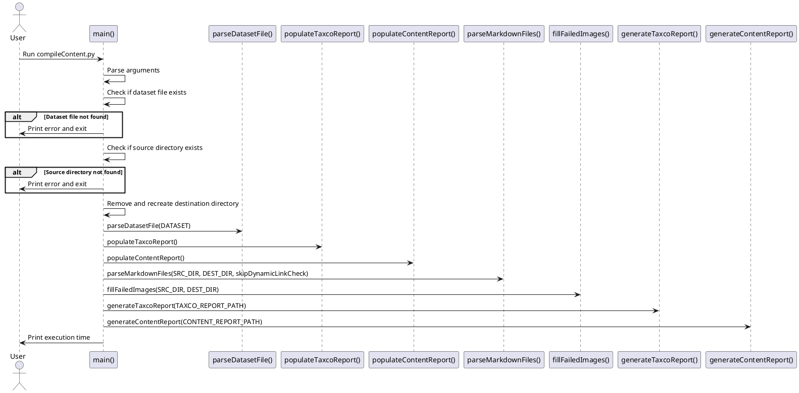
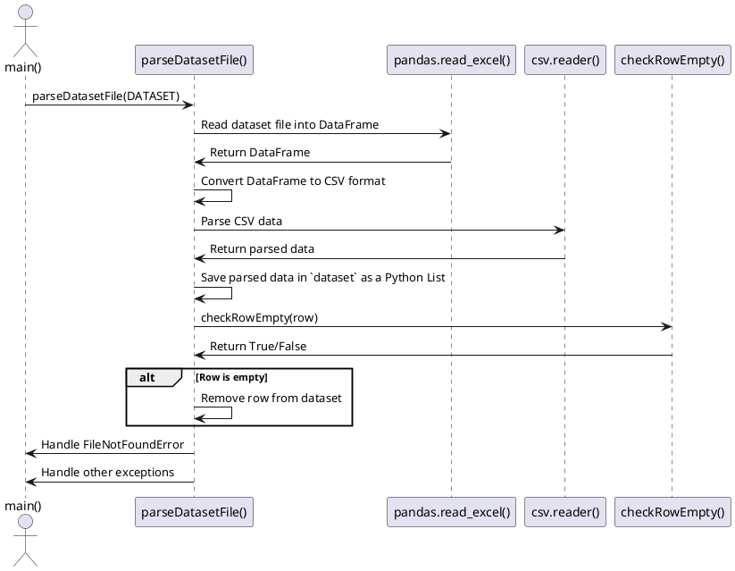
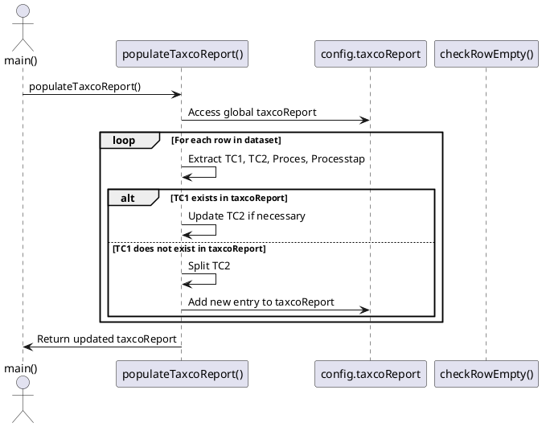

# Content Compiler Script 
This Python script automates the process of compiling and validating Markdown files based on taxonomy codes. It performs the following tasks: 

1. **Dataset Parsing**: Reads and parses the dataset file containing taxonomy information.
2. **Markdown Parsing**: Parses Markdown files from the source directory, extracts metadata, and validates dynamic links.
3. **Image Handling**: Copies images referenced in the Markdown files to the build directory and checks for missing or unused images.
4. **Report Generation**: Generates reports summarizing the processing results, including failed files, work-in-progress items, and successfully processed files.
5. **Taxonomy Report**: Generates a taxonomy report detailing the implementation status of various taxonomy codes across different levels.

## Dependencies
The script requires the following Python packages:
- `pandas`: For handling and manipulating the dataset file.
- `openpyxl`: For reading Excel files.
- `shutil`: For file operations such as copying and removing directories.
- `argparse`: For parsing command-line arguments.
- `pathlib`: For handling filesystem paths in an object-oriented way.

## Usage
To run the script, use the following command:
```sh
python compileContent.py
```

You can also skip the dynamic link validation by adding the --skip-link-check flag:
```sh
python compileContent.py --skip-link-check
```

##  `config.py`
This is the config file which stores the different config options.
It's also used to save the state of the reports.
- Source Directory: src/cloned_repo/content
- Destination Directory: src/cloned_repo/build
- Dataset File: src/datasets/dataset.xlsx
- Taxonomy Report Path: src/cloned_repo/taxco_report.md
- Content Report Path: src/cloned_repo/content_report.md

## Report structure
The script produces two md reports.
- `taxco_report.md`: Is used to see which taxco's are used
- `content_report.md` Is used to see detaild info on specific files.

### `taxco_report.md`
The taxco report has the following structure in the code:
```

```


## Detailed script workings
The following steps and methods are used to compile the md source files to build files
 
### `compileContent.py`
This is the main script file, this runs the show.

#### `def Main`
Main method which calls the other methods 


### `parseDatasetFile()`
This method is used to read the dataset file and parse it to a `list`. This is needed because the list is used in the entire workflow and a way easier to work with.


### `pupulateTaxcoReport()`
Before the content gets complied the taxco object report is filled based on the content of the dataset.
This is done so the taxco report has a row for every taxco. During content compling this report gets updated after a file is parsed.
By doing it this way we ensure that every taxco is in the report and as soon as a file has no error the status which is an error by default gets updated to the correct status.



